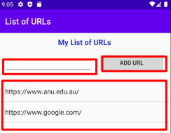

# Task 1: Layout

## First steps

1. Fork the lab: comp2100-lab-07
2. Clone your fork
3. Create a new Android Studio project in the “src” folder (as discussed below)

## Project setup

Let's create a new Android Studio project by clicking **New Project** or **File** > **New** > **New Project**.

 Select the **EmptyActivity** template, and set the save location to the `src` folder of your clone. You may need to create this folder. 
 
Ensure that the language is set to Java, and the minimum SDK is set to API 33 (or API 32, if you don't have API 33).

It may take some time for Gradle to configure this project. Ensure you are connected to the internet while this is occurring. It should be completed when you see `Gradle sync finished in...` in the bottom-left of the window.

Click the green play button to run your project. The lab machines have a virtual device installed by default; you will need to create one if you are using your personal machine. To create one, go to **Tools** > **Device Manager** > **Create Device** > **Virtual**. Select a (phone) device you would like to emulate, click **Next**, and download a system image with API level 33+. Upon completion, click **Next** then **Finish**.

 If you encounter an error while installing the system image, refer to the [troubleshooting information](Troubleshooting.md). You should now be able to select your virtual device, and run it. Upon loading, you should see a screen that looks like:

## The layout

Returning to your project, the file `activity_main.xml` should be open. If it is not, open it under `app` > `res` > `layout`. This shows a preview of what the activity will look like on a device.

Click on the "Hello World!" `TextView`. You will be able to see its attributes in the right panel. At the top, set its `id` to `title_bookmark` and set hte title to your list of URLs (**Common Attribute** > **Text**).

Make the activity follow the following specification. You can use the Constraint Widget for each view in the right panel to specify positions.

- The `TextView` must be centered horizontally and be 10dp from the top parent.
- Add a `PlainText`, and rename it to `EditText`. (The contents of an `EditText` may be altered by the user with the on-screen keyboard, unlike a `TextView`)It must be 5dp from the left parent and 60dp from the top parent.
- Add a `Button`, labelled `ADD URL`, vertically aligned with the EditText, and 10dp from the EditText and 10dp from the right parent.
- Add a `ListView` placed 10dp below the EditText and Button, and match (be 0dp from) the bottom parent.

The 'parent' here refers to the parent view -- the view that `activity_main` sits within. In more complex activities, the 'parent' of a view may be a smaller container than the entire screen, but that functionality is not necessary here.

Your `activity_main` should look like:

Now, create a new activity, named `ActivityWeb`. THis will generate two new files: `activity_web.xml` and `ActivityWeb.java`, and add a `WebView` inside `activity_web.xml`. The `WebView` must match the parent screen (be full width). That's all for this activity.

To receive marks in this task you need to:
- Create an intent to go from the main activity to the
  activity containing the WebView. The intent must be
  associated to a button or to a ListView item.
- All items must be sensibly positioned (no overlaps or
  extreme misalignment).
- Note that we will ask you to change the screen size
  of your app by clicking and dragging (ask your tutor to demonstrate it).

>>>
### Info
From the Android Dev docs: "An Intent is a messaging object you can use to request an action from another app component". To execute an intent, use the `startActivity` function.
>>>

>>>
### Important
**You need to show your tutor that your app is fully functional. If you are unable to show your lab tutor, a drop-in tutor can be arranged to mark your lab before the submission deadline.**
>>>
